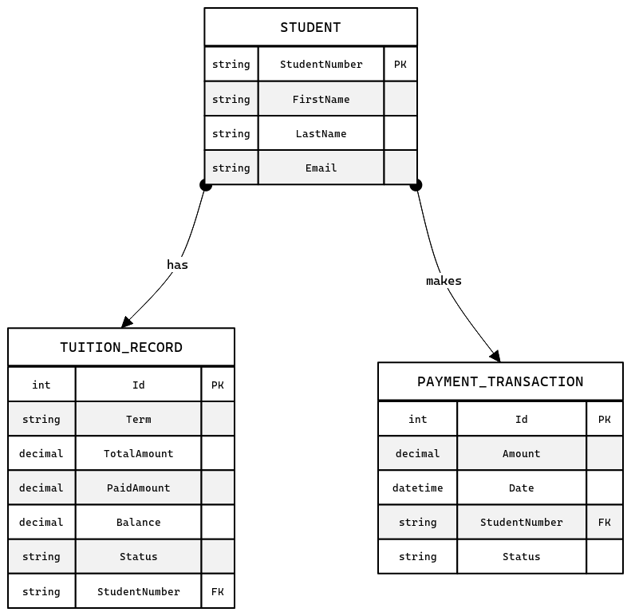

# University Payment System API (Group 2)

This project is a cloud-based **University Tuition Payment System API** developed for the SE 4458 course. The system allows students to query tuition debts, make payments, and enables administrators to manage tuition records.

## 🚀 Features

* **Platform:** .NET 8.0 (Core Web API)
* **Database:** AWS RDS (SQL Server)
* **ORM:** Entity Framework Core
* **Authentication:** JWT (JSON Web Token) based auth.
* **API Gateway:** Ocelot (For Rate Limiting and Routing).
* **Logging:** Custom Middleware on Gateway for Request/Response logging.
* **Documentation:** Swagger UI (Accessible via Gateway).

## 🏗️ Architecture & Design Decisions

1.  **API Gateway (Ocelot):**
    * Clients (Mobile, Banking App) cannot access the internal API directly; they must go through the Gateway (Port 5200).
    * **Rate Limiting:** As per Group 2 requirements, mobile queries are limited to **3 requests per day**.
    * **Routing:** Requests to `localhost:5200/gateway/...` are forwarded to the internal API service (5074).

2.  **Cloud Database (AWS RDS):**
    * The project uses a hosted SQL Server on AWS, ensuring the application is accessible from anywhere and not tied to a local database instance.

3.  **Security:**
    * **Banking App & Admin:** Requires valid JWT Token (Login).
    * **Mobile App:** Public access (Anonymous) as per requirements.

## 🗂️ Data Model (ER Diagram)

The database schema and relationships are designed as follows:



## 🛠️ Installation & Running

To run the project locally, you need two separate terminals:

1.  **Start the Internal API:**
    ```bash
    cd UniversityPaymentApi
    dotnet run
    ```

2.  **Start the API Gateway:**
    ```bash
    cd UniversityGateway
    dotnet run
    ```

**Base Access URL:** `http://localhost:5200/gateway/mobile/tuition/{studentNumber}`

## ⚠️ Challenges & Solutions

* **Gateway Swagger Integration:** Configured `OpenApiServer` in `Program.cs` to ensure Swagger UI points to the Gateway URL instead of the internal API.
* **CORS & Cloud DB:** Configured AWS RDS Security Groups to allow inbound traffic for database connectivity.

---
**Course:** SE 4458 - Software Architecture
**Group:** 2